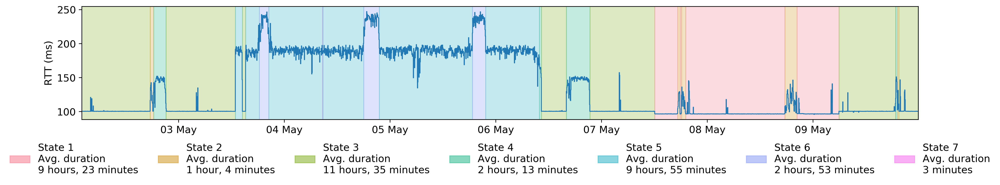

# Atlas Trends API demonstration



## Introduction

The Atlas Trends API is an implementation of a novel method to cluster RTT time series using nonparametric Bayesian models. The API allows producing humanlike segmentation of [RIPE Atlas](http://atlas.ripe.net/) RTT time series.

This repository contains the following Python notebooks demonstrating the API usage:

Name | Description | Online Notebook
:----|:------------|:-----------------
Atlas Trends API | Overview of the API | [](https://colab.research.google.com/github/maxmouchet/atlas-trends-demo/blob/master/notebooks/Atlas%20Trends%20API.ipynb)

## Citation

M. Mouchet, S. Vaton, T. Chonavel, E. Aben and J. D. Hertog, "Large-Scale Characterization and Segmentation of Internet Path Delays With Infinite HMMs," in [_IEEE Access_](https://ieeexplore.ieee.org/document/8964300), vol. 8, pp. 16771-16784, 2020.

```bibtex
@article{mouchet2019large,
  author={M. {Mouchet} and S. {Vaton} and T. {Chonavel} and E. {Aben} and J. {Den Hertog}},
  journal={IEEE Access},
  title={Large-Scale Characterization and Segmentation of Internet Path Delays With Infinite HMMs},
  year={2020},
  volume={8},
  pages={16771-16784},
  doi={10.1109/ACCESS.2020.2968380},
  ISSN={2169-3536}
}
```

## Getting Started

You can run the notebooks on Google Colab by following the links at the top, or locally by running the following in a terminal:

```bash
git clone https://github.com/maxmouchet/atlas-trends-demo.git
cd atlas-trends-demo
python3 -m venv trends-env; source trends-env/bin/activate
pip install -r requirements.txt
jupyter lab
```
